# Gelmat Class Hierarchy Diagrams

**Ontology:** Gelmat (`https://w3id.org/gelmat/`, prefix `gmat:`) · Version 1.1.0
**Base:** [PolyMat](https://w3id.org/polymat/) (`pmat:`)

These diagrams give a visual overview of the class hierarchy. Arrows point from parent
class to subclass. The complete listing of all classes is in
[`class_hierarchy.md`](class_hierarchy.md).

**Legend**

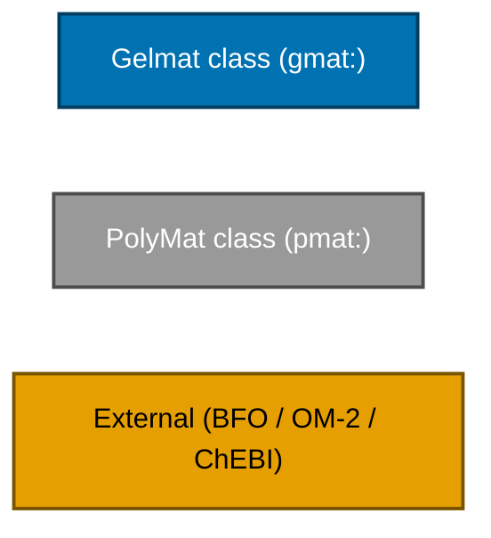

---

## 0 · How Gelmat builds on PolyMat

PolyMat provides the upper structure: substances, methods, devices, features, and roles.
Gelmat adds the sol-gel vocabulary underneath it. 289 of the 299 Gelmat classes inherit
from a PolyMat class; the remaining 10 (applications, the synthesis protocol, the ratio
value node) attach directly to BFO, OM-2, or PROV-O. PolyMat's own classes for polymer
chemistry, membrane fabrication, data management, and laboratory infrastructure come in
through the import and are documented in the [PolyMat repository](https://w3id.org/polymat/).

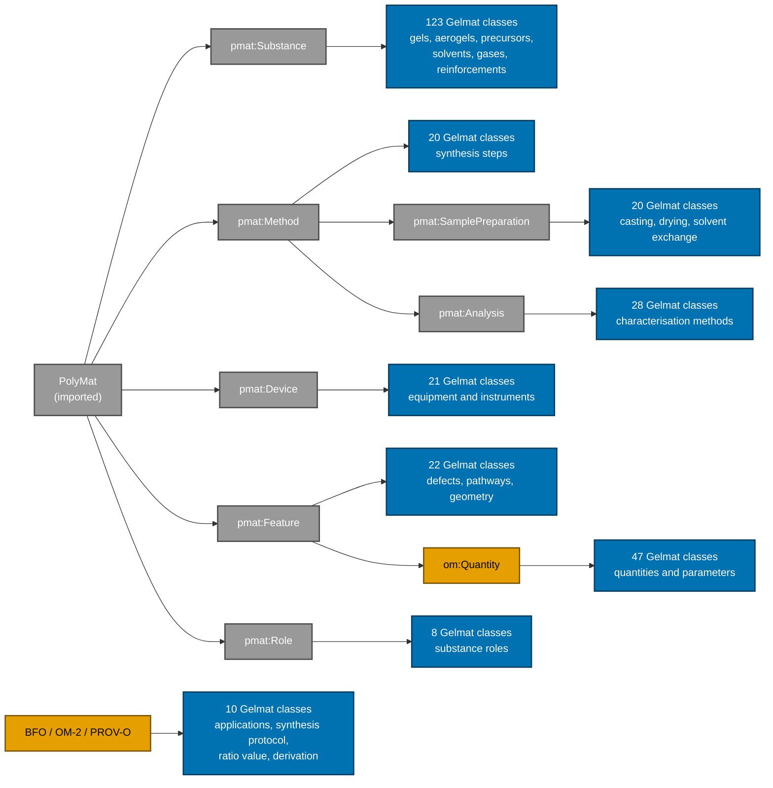

---

## 1 · Material Entities

### 1.1 Gel-Based Materials and Aerogel Types

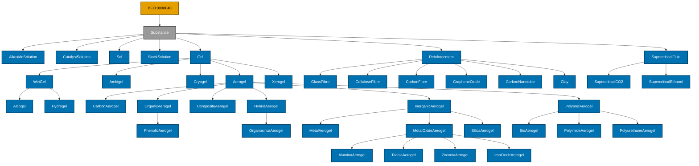

### 1.2 Precursors

```mermaid
graph TD
    CHEBI["CHEBI:24431 (chemical entity)"]:::ext --> Precursor:::gmat
    CHEBI --> OrganosiliconCompound:::gmat

    Precursor --> SilicaPrecursor:::gmat
    Precursor --> MetalOxidePrecursor:::gmat
    Precursor --> OrganicPrecursor:::gmat
    Precursor --> PolymerPrecursor:::gmat
    Precursor --> BiopolymerPrecursor:::gmat

    SilicaPrecursor --> SiliconAlkoxidePrecursor:::gmat
    OrganosiliconCompound --> SiliconAlkoxidePrecursor
    SilicaPrecursor --> SilicatePrecursor:::gmat
    SilicatePrecursor --> SodiumSilicate:::gmat

    SiliconAlkoxidePrecursor --> Tetraethoxysilane:::gmat
    SiliconAlkoxidePrecursor --> TMOS:::gmat
    SiliconAlkoxidePrecursor --> MTMS:::gmat
    SiliconAlkoxidePrecursor --> MTES:::gmat
    SiliconAlkoxidePrecursor --> VTMS:::gmat
    SiliconAlkoxidePrecursor --> APTES:::gmat
    SiliconAlkoxidePrecursor --> GPTMS:::gmat
    SiliconAlkoxidePrecursor --> BTMSE:::gmat
    SiliconAlkoxidePrecursor --> PEDS:::gmat
    Monomer["Monomer"]:::poly -.->|also parent of| Tetraethoxysilane

    MetalOxidePrecursor --> MetalAlkoxide:::gmat
    MetalAlkoxide --> AluminiumSecButoxide:::gmat
    MetalAlkoxide --> TitaniumIsopropoxide:::gmat
    MetalAlkoxide --> ZirconiumPropoxide:::gmat

    OrganicPrecursor --> Resorcinol:::gmat
    OrganicPrecursor --> Formaldehyde:::gmat
    OrganicPrecursor --> Phenol:::gmat
    OrganicPrecursor --> Melamine:::gmat
    OrganicPrecursor --> Furfural:::gmat
    OrganicPrecursor --> Tannin:::gmat
    OrganicPrecursor --> Lignin:::gmat

    PolymerPrecursor --> Dianhydride:::gmat
    PolymerPrecursor --> Diamine:::gmat
    PolymerPrecursor --> Isocyanate:::gmat
    PolymerPrecursor --> Polyol:::gmat

    BiopolymerPrecursor --> Cellulose:::gmat
    Cellulose --> Nanocellulose:::gmat
    BiopolymerPrecursor --> Chitosan:::gmat
    BiopolymerPrecursor --> Alginate:::gmat
    BiopolymerPrecursor --> Pectin:::gmat
    BiopolymerPrecursor --> Gelatin:::gmat
    BiopolymerPrecursor --> Starch:::gmat

    classDef gmat fill:#0072b2,stroke:#003d61,color:#ffffff,stroke-width:2px;
    classDef poly fill:#999999,stroke:#4d4d4d,color:#ffffff,stroke-width:2px;
    classDef ext  fill:#e69f00,stroke:#7a5500,color:#000000,stroke-width:2px;
```

### 1.3 Solvents, Catalysts, Additives, Gases

```mermaid
graph TD
    CHEBI["CHEBI:24431 (chemical entity)"]:::ext --> Acid:::gmat
    CHEBI --> Base:::gmat
    CHEBI --> Alcohol:::gmat
    CHEBI --> Acetone:::gmat
    CHEBI --> Hexane:::gmat
    CHEBI --> Heptane:::gmat
    CHEBI --> Dimethylformamide:::gmat
    CHEBI --> DryingControlChemicalAdditive:::gmat
    CHEBI --> AmmoniumCompound:::gmat
    CHEBI --> FluorideSalt:::gmat
    CHEBI --> Gas:::gmat
    CHEBI --> Urea:::gmat
    CHEBI --> Water:::gmat
    CHEBI --> SilylationAgent:::gmat
    CHEBI --> Surfactant:::gmat
    CHEBI --> Crosslinker:::gmat

    Acid --> AcidCatalyst:::gmat
    AcidCatalyst --> NitricAcid:::gmat
    AcidCatalyst --> AceticAcid:::gmat
    AcidCatalyst --> OxalicAcid:::gmat
    AcidCatalyst --> CitricAcid:::gmat
    AcidCatalyst --> HydrofluoricAcid:::gmat

    Base --> BaseCatalyst:::gmat
    BaseCatalyst --> SodiumHydroxide:::gmat
    BaseCatalyst --> SodiumCarbonate:::gmat

    Alcohol --> Ethanol:::gmat
    Alcohol --> Methanol:::gmat
    Alcohol --> Isopropanol:::gmat

    DryingControlChemicalAdditive --> Formamide:::gmat
    DryingControlChemicalAdditive --> Glycerol:::gmat

    AmmoniumCompound --> AmmoniumHydroxide:::gmat
    FluorideSalt --> AmmoniumFluoride:::gmat

    Gas --> Nitrogen:::gmat
    Gas --> Argon:::gmat
    Gas --> Air:::gmat
    Gas --> CarbonDioxide:::gmat

    SilylationAgent --> Trimethylchlorosilane:::gmat
    SilylationAgent --> Hexamethyldisilazane:::gmat

    Water --> DeionizedWater:::gmat

    classDef gmat fill:#0072b2,stroke:#003d61,color:#ffffff,stroke-width:2px;
    classDef ext  fill:#e69f00,stroke:#7a5500,color:#000000,stroke-width:2px;
```

---

## 2 · Processes and Methods

```mermaid
graph TD
    Procedure:::poly --> Method:::poly
    Method --> CreationProcess:::gmat
    Method --> SamplePreparation:::poly
    Method --> Analysis:::poly

    %% Creation
    CreationProcess --> AerogelSynthesis:::gmat
    CreationProcess --> Aging:::gmat
    CreationProcess --> Condensation:::gmat
    CreationProcess --> Gelation:::gmat
    CreationProcess --> SolFormation:::gmat
    CreationProcess --> SolGelTransition:::gmat
    CreationProcess --> ThermalTreatment:::gmat
    AerogelSynthesis --> APDAerogelSynthesis:::gmat
    SolFormation --> Hydrolysis:::gmat
    Gelation --> AcidCatalysis:::gmat
    Gelation --> BaseCatalysis:::gmat
    Gelation --> TwoStepCatalysis:::gmat
    ThermalTreatment --> Pyrolysis:::gmat
    ThermalTreatment --> Calcination:::gmat
    ThermalTreatment --> Curing:::gmat
    ThermalTreatment --> Sintering:::gmat
    ThermalTreatment --> Activation:::gmat
    ThermalTreatment --> TemperatureRamping:::gmat

    %% Sample preparation
    SamplePreparation --> Casting:::gmat
    SamplePreparation --> Sonication:::gmat
    SamplePreparation --> Mixing:::gmat
    Mixing --> Stirring:::gmat
    SamplePreparation --> IonExchange:::gmat
    SamplePreparation --> FreezeCasting:::gmat
    SamplePreparation --> Impregnation:::gmat
    SamplePreparation --> Cooling:::gmat
    SamplePreparation --> Pressurization:::gmat
    SamplePreparation --> Depressurization:::gmat
    SamplePreparation --> SolventExchange:::gmat
    SamplePreparation --> SurfaceModification:::gmat
    SurfaceModification --> SurfaceSilylation:::gmat
    SamplePreparation --> WashingCycle:::gmat
    SamplePreparation --> Drying:::poly
    Drying --> AmbientPressureDrying:::gmat
    Drying --> FreezeDrying:::gmat
    Drying --> MicrowaveDrying:::gmat
    Drying --> SupercriticalDrying:::gmat
    SupercriticalDrying --> HighTemperatureSupercriticalDrying:::gmat
    Drying --> VacuumDrying:::gmat

    classDef gmat fill:#0072b2,stroke:#003d61,color:#ffffff,stroke-width:2px;
    classDef poly fill:#999999,stroke:#4d4d4d,color:#ffffff,stroke-width:2px;
    classDef ext  fill:#e69f00,stroke:#7a5500,color:#000000,stroke-width:2px;
```

### 2.1 Characterisation and Analysis

```mermaid
graph TD
    Method:::poly --> Analysis:::poly
    Analysis --> BulkDensityMeasurement:::gmat
    Analysis --> CompressionTesting:::gmat
    Analysis --> DifferentialScanningCalorimetry:::gmat
    Analysis --> EDXAnalysis:::gmat
    Analysis --> FTIRSpectroscopy:::gmat
    Analysis --> HydrophobicityTesting:::gmat
    Analysis --> OpticalTransmittanceMeasurement:::gmat
    Analysis --> PorosityMeasurement:::gmat
    Analysis --> RamanSpectroscopy:::gmat
    Analysis --> SANS:::gmat
    Analysis --> SAXS:::gmat
    Analysis --> SkeletalDensityMeasurement:::gmat
    Analysis --> SolidStateNMR:::gmat
    Analysis --> SpecificSurfaceAreaMeasurement:::gmat
    Analysis --> TEMImaging:::gmat
    Analysis --> ThermalConductivityTesting:::gmat
    Analysis --> ThermogravimetricAnalysis:::gmat
    Analysis --> XPSAnalysis:::gmat
    Analysis --> XRayDiffraction:::gmat

    PorosityMeasurement --> BETAnalysis:::gmat
    PorosityMeasurement --> BJHAnalysis:::gmat
    PorosityMeasurement --> MercuryIntrusionPorosimetry:::gmat
    SkeletalDensityMeasurement --> HeliumPycnometry:::gmat
    ThermalConductivityTesting --> GuardedHotPlate:::gmat
    ThermalConductivityTesting --> HeatFlowMeterMethod:::gmat
    ThermalConductivityTesting --> TransientHotWire:::gmat
    ThermalConductivityTesting --> LaserFlash:::gmat

    classDef gmat fill:#0072b2,stroke:#003d61,color:#ffffff,stroke-width:2px;
    classDef poly fill:#999999,stroke:#4d4d4d,color:#ffffff,stroke-width:2px;
```

---

## 3 · Laboratory Equipment

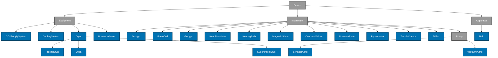

---

## 4 · Features, Defects, Parameters, Roles

```mermaid
graph TD
    Feature:::poly --> AerogelDefect:::gmat
    Feature --> GelationPathway:::gmat
    Feature --> Geometry:::gmat
    Feature --> NetworkConnectivity:::gmat
    BFO_0000019["BFO:0000019 quality"]:::ext --> ProcessParameter:::gmat
    om_Quantity["om:Quantity"]:::ext --> ProcessParameter

    AerogelDefect --> Cracking:::gmat
    AerogelDefect --> IncompleteDrying:::gmat
    AerogelDefect --> Macroporosity:::gmat
    AerogelDefect --> NonuniformStructure:::gmat
    AerogelDefect --> Opacity:::gmat
    AerogelDefect --> SpringbackFailure:::gmat
    AerogelDefect --> StructuralCollapse:::gmat

    GelationPathway --> AcidCatalysisPathway:::gmat
    GelationPathway --> BaseCatalysisPathway:::gmat
    GelationPathway --> TwoStepCatalysisPathway:::gmat
    GelationPathway --> DissolutionParticipation:::gmat
    GelationPathway --> PhaseSeparation:::gmat
    GelationPathway --> SolGelPolymerisation:::gmat

    Geometry --> Beads:::gmat
    Geometry --> DogBone:::gmat
    Geometry --> Monolith:::gmat
    Geometry --> Slabs:::gmat

    ProcessParameter --> ExchangeRatio:::gmat
    ProcessParameter --> MolarRatio:::gmat
    MolarRatio --> WaterToSilicaRatio:::gmat
    ProcessParameter --> PHCondition:::gmat
    ProcessParameter --> PressureProfile:::gmat
    ProcessParameter --> StirringRate:::gmat
    ProcessParameter --> TemperatureProfile:::gmat
    ProcessParameter --> VolumeRatio:::gmat

    om_Measure["om:Measure"]:::ext --> RatioValue:::gmat
    BFO_0000031["BFO:0000031 generically dependent continuant"]:::ext --> SynthesisProtocol:::gmat

    classDef gmat fill:#0072b2,stroke:#003d61,color:#ffffff,stroke-width:2px;
    classDef poly fill:#999999,stroke:#4d4d4d,color:#ffffff,stroke-width:2px;
    classDef ext  fill:#e69f00,stroke:#7a5500,color:#000000,stroke-width:2px;
```

### 4.1 Roles and Applications

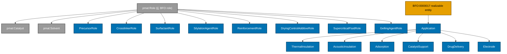

---

## 5 · Quantitative Measures (OM-2)

```mermaid
graph TD
    Quantity["om:Quantity"]:::ext --> Density:::gmat
    Density --> BulkDensity:::gmat
    Density --> SkeletalDensity:::gmat
    Density --> TapDensity:::gmat
    Quantity --> SurfaceArea:::gmat
    Quantity --> Porosity:::gmat
    Quantity --> PoreVolume:::gmat
    Quantity --> PoreSizeDistribution:::gmat
    Quantity --> ContactAngle:::gmat
    Quantity --> Shrinkage:::gmat
    Quantity --> Transmittance:::gmat
    Quantity --> MassFraction:::gmat
    Quantity --> HeatingRate:::gmat
    Quantity --> PHValue:::gmat
    Quantity --> PoissonRatio:::gmat
    Quantity --> ThermalExpansionCoefficient:::gmat
    Quantity --> VolumetricFlowRate:::gmat
    Quantity --> ActivationEnergy:::gmat
    Quantity --> ArrheniusConstant:::gmat
    Quantity --> CoefficientOfDetermination:::gmat
    Pressure["om:Pressure"]:::ext
    Length["om:Length"]:::ext --> ParticleSize:::gmat
    Length --> MeanPoreSize:::gmat
    Time["om:Time"]:::ext --> Duration:::gmat
    Time --> GelationTime:::gmat
    Concentration["om:AmountOfSubstanceConcentration"]:::ext --> SolConcentration:::gmat

    classDef gmat fill:#0072b2,stroke:#003d61,color:#ffffff,stroke-width:2px;
    classDef ext  fill:#e69f00,stroke:#7a5500,color:#000000,stroke-width:2px;
```

### 5.1 Mechanical Properties

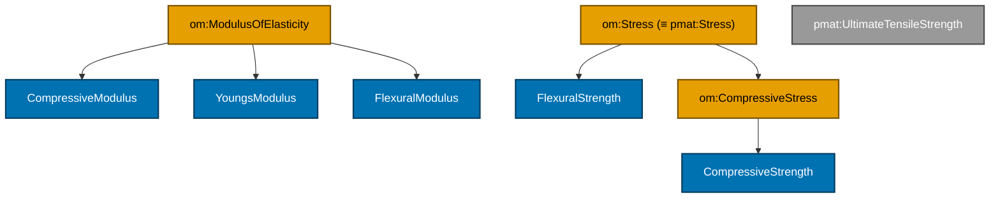

### 5.2 Thermal Properties

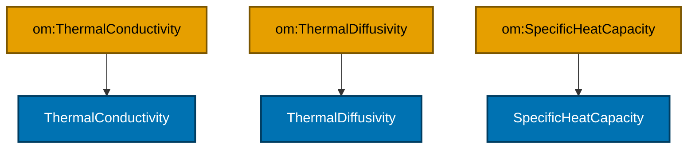

### 5.3 Fractal, Scattering & Structural Descriptors

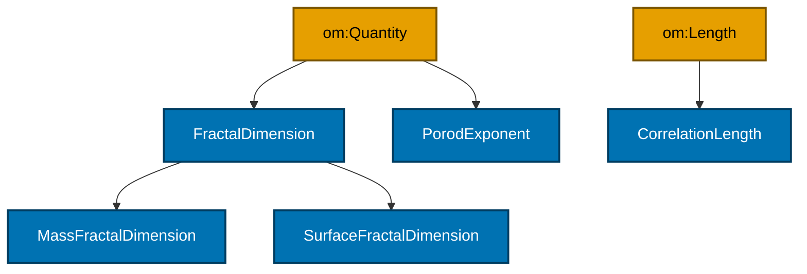

> The full set of quantity classes and their canonical SI units is asserted via
> `gmat:hasCanonicalUnit` in `gelmat.ttl`.
