# MTMS Aerogel Data Queries

Competency questions for the MTMS organosilica aerogel data in `aerogel_data.ttl`. The dataset covers samples A to H, prepared with different MTMS/MeOH ratios; samples E to H include kinetic studies.

The diagrams use the following color coding:

🔵 Processes (light blue)
🟡 Chemicals/Substances (yellow)
🟢 Results/Values (green)
🟠 Equipment (orange)
🔴 Temperature/Energy parameters (red/orange)
🟣 Ratios (purple)

## Prefixes for MTMS Queries

```sparql
PREFIX rdf: <http://www.w3.org/1999/02/22-rdf-syntax-ns#>
PREFIX rdfs: <http://www.w3.org/2000/01/rdf-schema#>
PREFIX owl: <http://www.w3.org/2002/07/owl#>
PREFIX xsd: <http://www.w3.org/2001/XMLSchema#>
PREFIX prov: <http://www.w3.org/ns/prov#>
PREFIX obo: <http://purl.obolibrary.org/obo/>
PREFIX om: <http://www.ontology-of-units-of-measure.org/resource/om-2/>
PREFIX : <https://w3id.org/gelmat/data/>
```

---

## MQ1: How many aerogel syntheses are in the database?

**Natural Language Question**: What is the total count of aerogel synthesis processes recorded in the database?

**SPARQL Query**:
```sparql
PREFIX rdf: <http://www.w3.org/1999/02/22-rdf-syntax-ns#>
PREFIX gmat: <https://w3id.org/gelmat/>

SELECT (COUNT(?synthesis) AS ?totalSyntheses)
WHERE {
  ?synthesis rdf:type gmat:AerogelSynthesis .
}
```

**Expected Results**: 8 (Samples A through H)

**Mermaid Diagram**:
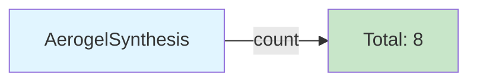

---

## MQ2: What are all the aerogel samples and their precursors?

**Natural Language Question**: List all aerogel samples (organosilica, from MTMS) in the database along with their silicon precursor.

**SPARQL Query**:
```sparql
PREFIX rdf: <http://www.w3.org/1999/02/22-rdf-syntax-ns#>
PREFIX rdfs: <http://www.w3.org/2000/01/rdf-schema#>
PREFIX gmat: <https://w3id.org/gelmat/>

SELECT ?aerogel ?aerogelLabel ?precursor ?precursorLabel
WHERE {
  ?aerogel rdf:type/rdfs:subClassOf* gmat:Aerogel ;
           rdfs:label ?aerogelLabel ;
           gmat:hasPrecursor ?precursor .
  ?precursor rdfs:label ?precursorLabel .
}
ORDER BY ?aerogelLabel
```

**Expected Results**: 8 aerogels (A-H), all using MTMS (Trimethoxymethylsilane) as precursor

**Mermaid Diagram**:
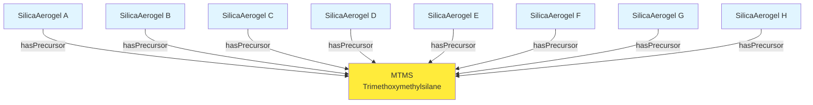

---

## MQ3: What are the complete process steps for a specific synthesis?

**Natural Language Question**: What process steps are part of MTMS Synthesis Sample A?

**SPARQL Query**:
```sparql
PREFIX rdf: <http://www.w3.org/1999/02/22-rdf-syntax-ns#>
PREFIX rdfs: <http://www.w3.org/2000/01/rdf-schema#>
PREFIX owl: <http://www.w3.org/2002/07/owl#>
PREFIX obo: <http://purl.obolibrary.org/obo/>
PREFIX : <https://w3id.org/gelmat/data/>

SELECT ?process ?processLabel ?processType
WHERE {
  :MTMS_Synthesis_Sample_A obo:BFO_0000051 ?process .
  ?process rdfs:label ?processLabel ;
           rdf:type ?processType .
  FILTER(?processType != owl:NamedIndividual)
}
ORDER BY ?processLabel
```

**Expected Results**: Sol Formation, Gelation, Aging, Solvent Exchange, Drying

**Mermaid Diagram**:
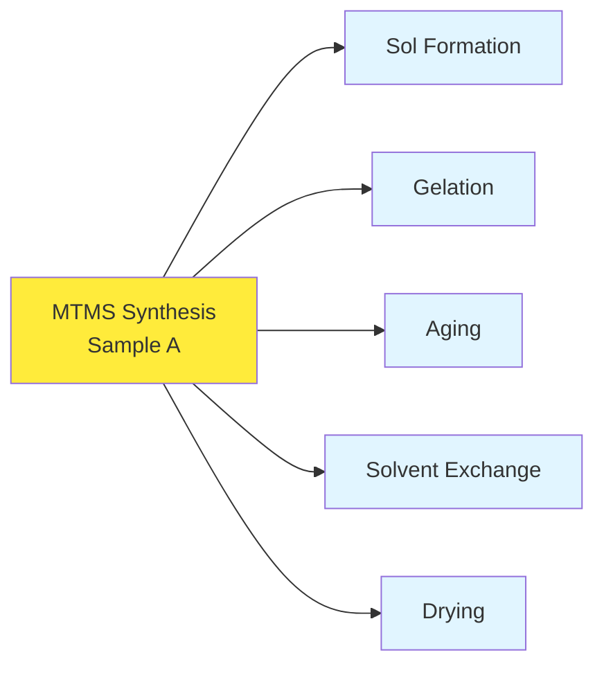

---

## MQ4: What is the aging time (duration) for each sample?

**Natural Language Question**: What is the aging duration used for each MTMS aerogel sample?

**SPARQL Query**:
```sparql
PREFIX rdf: <http://www.w3.org/1999/02/22-rdf-syntax-ns#>
PREFIX rdfs: <http://www.w3.org/2000/01/rdf-schema#>
PREFIX gmat: <https://w3id.org/gelmat/>
PREFIX obo: <http://purl.obolibrary.org/obo/>
PREFIX om: <http://www.ontology-of-units-of-measure.org/resource/om-2/>

SELECT ?duration ?durationLabel ?agingProcess ?value ?unit
WHERE {
  ?duration rdf:type gmat:Duration ;
            rdfs:label ?durationLabel ;
            obo:RO_0000052 ?agingProcess ;
            om:hasValue ?measure .
  ?agingProcess rdf:type gmat:Aging .
  ?measure om:hasNumericalValue ?value ;
           om:hasUnit ?unitIRI .
  OPTIONAL { ?unitIRI rdfs:label ?unit }  # label resolves when OM-2 is loaded
}
ORDER BY ?durationLabel
```

**Expected Results**: 172800 s (= 48 h) for all samples (A-D); values in SI seconds

**Mermaid Diagram**:
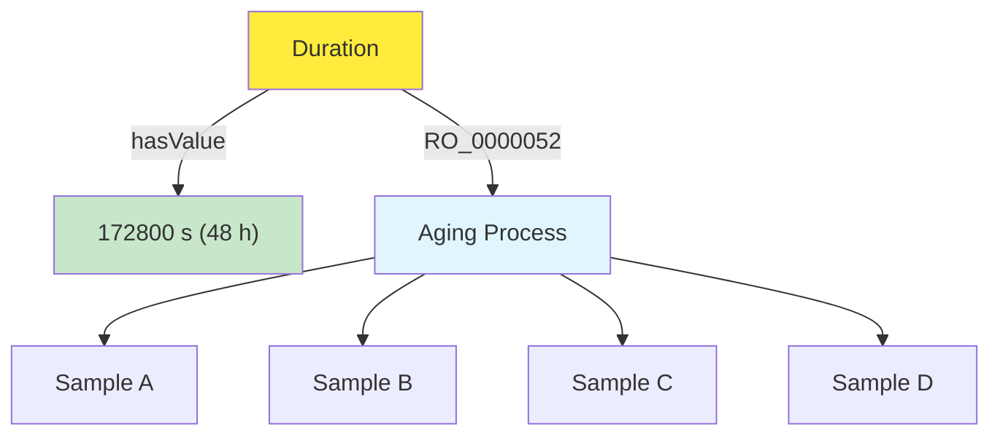

---

## MQ5: What is the aging temperature for each sample?

**Natural Language Question**: At what temperature is the aging process performed for each sample?

**SPARQL Query**:
```sparql
PREFIX rdf: <http://www.w3.org/1999/02/22-rdf-syntax-ns#>
PREFIX rdfs: <http://www.w3.org/2000/01/rdf-schema#>
PREFIX obo: <http://purl.obolibrary.org/obo/>
PREFIX om: <http://www.ontology-of-units-of-measure.org/resource/om-2/>
PREFIX gmat: <https://w3id.org/gelmat/>

SELECT ?tempLabel ?agingProcess ?value ?unit
WHERE {
  ?temp rdf:type om:Temperature ;
        rdfs:label ?tempLabel ;
        obo:RO_0000052 ?agingProcess ;
        om:hasValue ?measure .
  ?agingProcess rdf:type gmat:Aging .
  ?measure om:hasNumericalValue ?value ;
           om:hasUnit ?unitIRI .
  OPTIONAL { ?unitIRI rdfs:label ?unit }  # label resolves when OM-2 is loaded
}
ORDER BY ?tempLabel
```

**Expected Results**: 323.15 K (= 50 °C) for all samples with aging temperature data; values in SI kelvin

**Mermaid Diagram**:
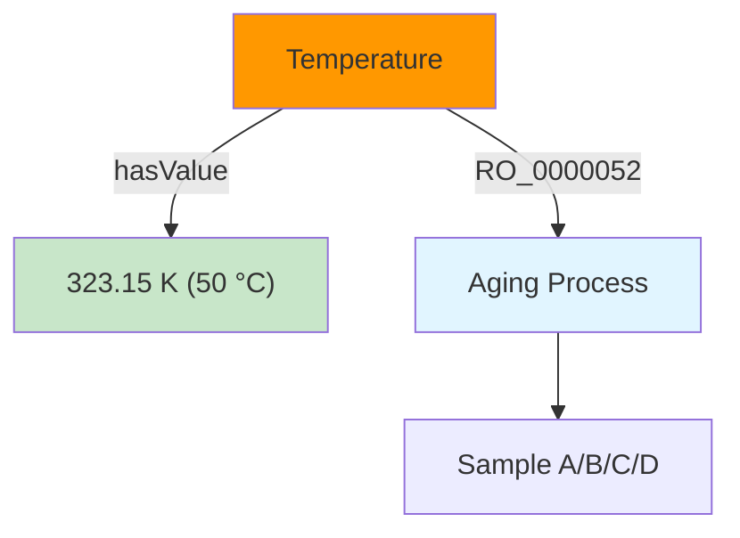

---

## MQ6: What is the drying temperature used in the synthesis?

**Natural Language Question**: What temperature is used during the drying process for each sample?

**SPARQL Query**:
```sparql
PREFIX rdf: <http://www.w3.org/1999/02/22-rdf-syntax-ns#>
PREFIX rdfs: <http://www.w3.org/2000/01/rdf-schema#>
PREFIX obo: <http://purl.obolibrary.org/obo/>
PREFIX om: <http://www.ontology-of-units-of-measure.org/resource/om-2/>
PREFIX pmat: <https://w3id.org/polymat/>

SELECT ?tempLabel ?dryingProcess ?value ?unit
WHERE {
  ?temp rdf:type om:Temperature ;
        rdfs:label ?tempLabel ;
        obo:RO_0000052 ?dryingProcess ;
        om:hasValue ?measure .
  ?dryingProcess rdf:type pmat:Drying .
  ?measure om:hasNumericalValue ?value ;
           om:hasUnit ?unitIRI .
  OPTIONAL { ?unitIRI rdfs:label ?unit }  # label resolves when OM-2 is loaded
}
ORDER BY ?tempLabel
```

**Expected Results**: 373.15 K (= 100 °C) for all samples with drying temperature data; values in SI kelvin

**Mermaid Diagram**:
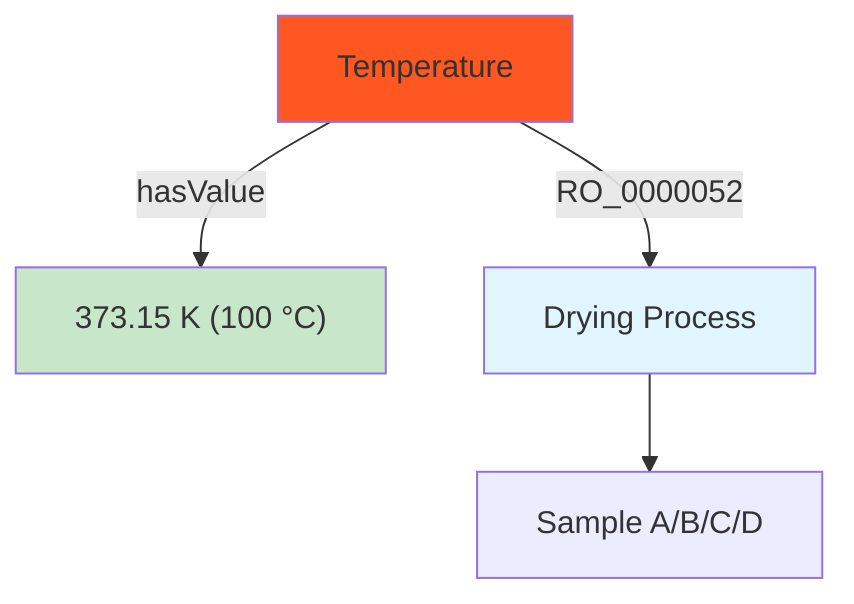

---

## MQ7: What are the MTMS to Methanol volume ratios for each sample?

**Natural Language Question**: What are the different MTMS/MeOH volume ratios used across all samples?

**SPARQL Query**:
```sparql
PREFIX rdf: <http://www.w3.org/1999/02/22-rdf-syntax-ns#>
PREFIX rdfs: <http://www.w3.org/2000/01/rdf-schema#>
PREFIX gmat: <https://w3id.org/gelmat/>
PREFIX om: <http://www.ontology-of-units-of-measure.org/resource/om-2/>

SELECT ?ratioLabel ?ratioValue
WHERE {
  ?ratio rdf:type gmat:VolumeRatio ;
         rdfs:label ?ratioLabel ;
         om:hasValue ?valueIRI .
  ?valueIRI gmat:hasRatioString ?ratioValue .
  FILTER(CONTAINS(?ratioLabel, "MTMS to Methanol"))
}
ORDER BY ?ratioLabel
```

**Expected Results**: 1:10 (A), 1:15 (B), 1:20 (C), 1:25 (D)

**Mermaid Diagram**:
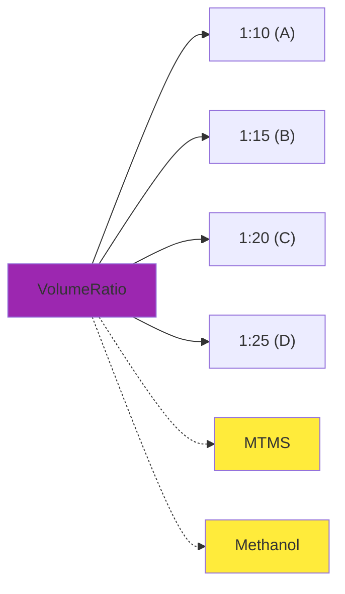

---

## MQ8: What is the H₂O to MTMS molar ratio (r value) for each sample?

**Natural Language Question**: What are the water to MTMS molar ratios used in the different synthesis experiments?

**SPARQL Query**:
```sparql
PREFIX rdf: <http://www.w3.org/1999/02/22-rdf-syntax-ns#>
PREFIX rdfs: <http://www.w3.org/2000/01/rdf-schema#>
PREFIX gmat: <https://w3id.org/gelmat/>
PREFIX om: <http://www.ontology-of-units-of-measure.org/resource/om-2/>

SELECT ?ratioLabel ?ratioValue ?sol
WHERE {
  # The molar ratio is a quality inhering in the sol (the reacting mixture)
  ?ratio rdf:type gmat:MolarRatio ;
         rdfs:label ?ratioLabel ;
         om:hasValue ?valueIRI ;
         <http://purl.obolibrary.org/obo/RO_0000052> ?sol .
  ?valueIRI gmat:hasRatioString ?ratioValue .
}
ORDER BY ?ratioLabel
```

**Expected Results**: Various r values: 8.09 (E), 9.71 (F), 11.33 (G), 12.94 (H), 59.75 (A-D)

**Mermaid Diagram**:
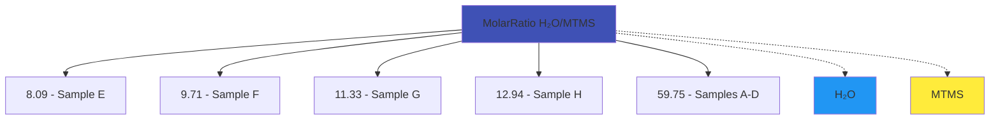

---

## MQ9: What equipment is used in the sol formation process?

**Natural Language Question**: What laboratory equipment is required for the sol formation step?

**SPARQL Query**:
```sparql
PREFIX rdf: <http://www.w3.org/1999/02/22-rdf-syntax-ns#>
PREFIX rdfs: <http://www.w3.org/2000/01/rdf-schema#>
PREFIX owl: <http://www.w3.org/2002/07/owl#>
PREFIX gmat: <https://w3id.org/gelmat/>

SELECT DISTINCT ?equipment ?equipmentLabel ?equipmentType
WHERE {
  ?solFormation rdf:type gmat:SolFormation ;
                gmat:requiresEquipment ?equipment .
  ?equipment rdfs:label ?equipmentLabel ;
             rdf:type ?equipmentType .
  FILTER(?equipmentType != owl:NamedIndividual)
}
```

**Expected Results**: Syringe Pump (1.667e-8 m³/s = 60 mL/h)

**Mermaid Diagram**:
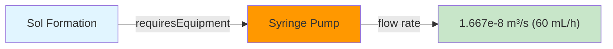

---

## MQ10: What substances are used in the sol formation process?

**Natural Language Question**: What chemical substances are combined during sol formation?

**SPARQL Query**:
```sparql
PREFIX rdf: <http://www.w3.org/1999/02/22-rdf-syntax-ns#>
PREFIX rdfs: <http://www.w3.org/2000/01/rdf-schema#>
PREFIX owl: <http://www.w3.org/2002/07/owl#>
PREFIX gmat: <https://w3id.org/gelmat/>

SELECT DISTINCT ?substance ?substanceLabel ?substanceType
WHERE {
  ?solFormation rdf:type gmat:SolFormation ;
                gmat:usesSubstance ?substance .
  ?substance rdfs:label ?substanceLabel ;
             rdf:type ?substanceType .
  FILTER(?substanceType != owl:NamedIndividual)
}
ORDER BY ?substanceLabel
```

**Expected Results**: MTMS, Methanol, Oxalic Acid, Water

**Mermaid Diagram**:
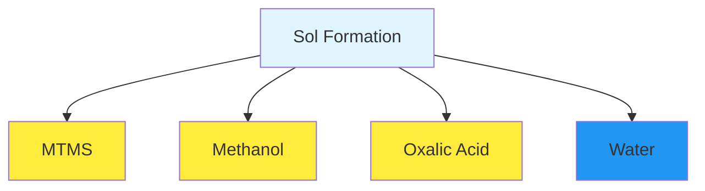

---

## MQ11: What intermediate products are generated during synthesis?

**Natural Language Question**: What are all the intermediate gel products formed throughout the synthesis process?

**SPARQL Query**:
```sparql
PREFIX rdf: <http://www.w3.org/1999/02/22-rdf-syntax-ns#>
PREFIX rdfs: <http://www.w3.org/2000/01/rdf-schema#>
PREFIX owl: <http://www.w3.org/2002/07/owl#>
PREFIX gmat: <https://w3id.org/gelmat/>

SELECT ?intermediate ?label ?type ?generatingProcess
WHERE {
  ?process gmat:generatesIntermediate ?intermediate .
  ?intermediate rdfs:label ?label ;
                rdf:type ?type .
  ?process rdfs:label ?generatingProcess .
  FILTER(?type != owl:NamedIndividual)
}
ORDER BY ?label
```

**Expected Results**: Sols, Wet Gels, Hydrogels, Alcogels for each sample

**Mermaid Diagram**:
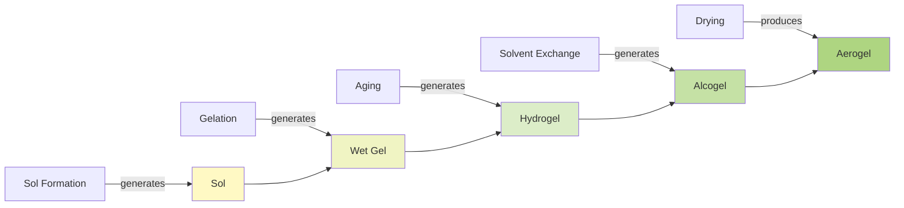

---

## MQ12: What is the flow rate of the syringe pump?

**Natural Language Question**: What volumetric flow rate is configured for the syringe pump equipment?

**SPARQL Query**:
```sparql
PREFIX rdf: <http://www.w3.org/1999/02/22-rdf-syntax-ns#>
PREFIX rdfs: <http://www.w3.org/2000/01/rdf-schema#>
PREFIX gmat: <https://w3id.org/gelmat/>
PREFIX obo: <http://purl.obolibrary.org/obo/>
PREFIX om: <http://www.ontology-of-units-of-measure.org/resource/om-2/>

SELECT ?flowRate ?value ?unit
WHERE {
  ?flowRate rdf:type gmat:VolumetricFlowRate ;
            obo:RO_0000052 ?equipment ;
            om:hasValue ?measure .
  ?equipment rdf:type gmat:SyringePump .
  ?measure om:hasNumericalValue ?value ;
           om:hasUnit ?unitIRI .
  OPTIONAL { ?unitIRI rdfs:label ?unit }  # label resolves when OM-2 is loaded
}
```

**Expected Results**: 1.667e-8 m³/s (= 60 mL/h); value in SI

**Mermaid Diagram**:
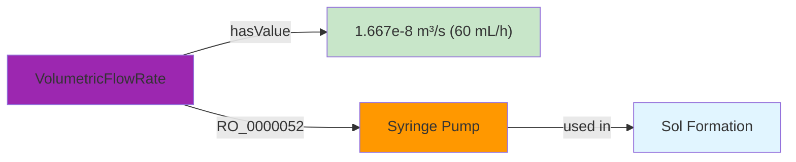

---

## MQ13: What is the complete reagent volume ratio for sol formation?

**Natural Language Question**: What is the overall volume ratio of all reagents (MTMS:MeOH:NH₄OH:C₂H₂O₄) used in sol formation?

**SPARQL Query**:
```sparql
PREFIX rdf: <http://www.w3.org/1999/02/22-rdf-syntax-ns#>
PREFIX rdfs: <http://www.w3.org/2000/01/rdf-schema#>
PREFIX gmat: <https://w3id.org/gelmat/>
PREFIX om: <http://www.ontology-of-units-of-measure.org/resource/om-2/>

SELECT ?ratioLabel ?ratioValue ?comment
WHERE {
  ?ratio rdf:type gmat:VolumeRatio ;
         rdfs:label ?ratioLabel ;
         om:hasValue ?valueIRI .
  ?valueIRI gmat:hasRatioString ?ratioValue .
  OPTIONAL { ?ratio rdfs:comment ?comment }
  FILTER(CONTAINS(?ratioLabel, "Sol Formation Overall"))
}
ORDER BY ?ratioLabel
```

**Expected Results**: 1:10:4:4 (A), 1:15:4:4 (B), 1:20:4:4 (C), 1:25:4:4 (D)

**Mermaid Diagram**:
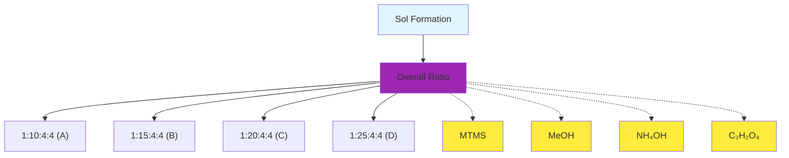

---

## MQ14: Which samples have kinetic study data (activation energy)?

**Natural Language Question**: Which samples have activation energy measurements from kinetic studies?

**SPARQL Query**:
```sparql
PREFIX rdf: <http://www.w3.org/1999/02/22-rdf-syntax-ns#>
PREFIX rdfs: <http://www.w3.org/2000/01/rdf-schema#>
PREFIX obo: <http://purl.obolibrary.org/obo/>
PREFIX om: <http://www.ontology-of-units-of-measure.org/resource/om-2/>
PREFIX : <https://w3id.org/gelmat/data/>

SELECT ?activationEnergy ?label ?gelationProcess ?value ?unit
WHERE {
  ?activationEnergy rdfs:label ?label ;
                    obo:RO_0000052 ?gelationProcess ;
                    om:hasValue ?measure .
  ?measure om:hasNumericalValue ?value ;
           om:hasUnit ?unitIRI .
  OPTIONAL { ?unitIRI rdfs:label ?unit }  # label resolves when OM-2 is loaded
  FILTER(CONTAINS(?label, "Activation Energy"))
}
ORDER BY ?label
```

**Expected Results**: Samples E (35450 J/mol), F (29900 J/mol), G (33290 J/mol), H (28890 J/mol); SI J/mol (= 35.45, 29.90, 33.29, 28.89 kJ/mol)

**Mermaid Diagram**:
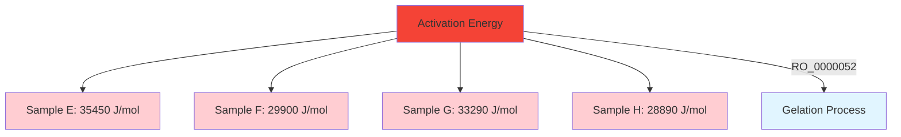

---

## MQ15: What are the Arrhenius constants for the gelation kinetics?

**Natural Language Question**: What are the Arrhenius pre-exponential constants for each sample's gelation kinetics?

**SPARQL Query**:
```sparql
PREFIX rdf: <http://www.w3.org/1999/02/22-rdf-syntax-ns#>
PREFIX rdfs: <http://www.w3.org/2000/01/rdf-schema#>
PREFIX obo: <http://purl.obolibrary.org/obo/>
PREFIX om: <http://www.ontology-of-units-of-measure.org/resource/om-2/>

SELECT ?arrheniusLabel ?gelation ?value
WHERE {
  ?arrhenius rdfs:label ?arrheniusLabel ;
             obo:RO_0000052 ?gelation ;
             om:hasValue ?measure .
  ?measure om:hasNumericalValue ?value .
  FILTER(CONTAINS(?arrheniusLabel, "Arrhenius"))
}
ORDER BY ?arrheniusLabel
```

**Expected Results**: E (244.86), F (51.15), G (272.73), H (72.39)

**Mermaid Diagram**:
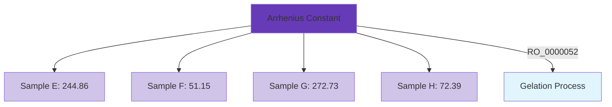

---

## MQ16: Which experiment contains which synthesis samples?

**Natural Language Question**: What synthesis samples are part of each experiment in the database?

**SPARQL Query**:
```sparql
PREFIX rdf: <http://www.w3.org/1999/02/22-rdf-syntax-ns#>
PREFIX rdfs: <http://www.w3.org/2000/01/rdf-schema#>
PREFIX obo: <http://purl.obolibrary.org/obo/>
PREFIX pmat: <https://w3id.org/polymat/>

SELECT ?experiment ?expLabel ?synthesis ?synthLabel
WHERE {
  ?experiment rdf:type pmat:Experiment ;
              rdfs:label ?expLabel ;
              obo:BFO_0000051 ?synthesis .
  ?synthesis rdfs:label ?synthLabel .
}
ORDER BY ?expLabel ?synthLabel
```

**Expected Results**: Experiment_01 contains Samples A, B, C, D

**Mermaid Diagram**:
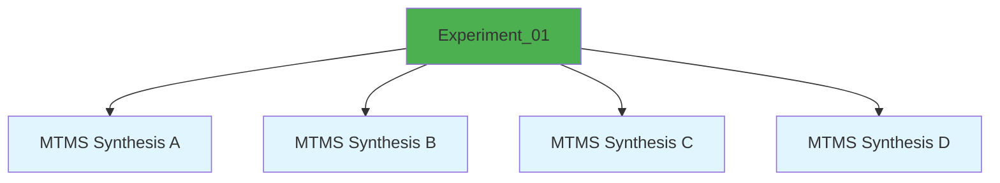

---

## MQ17: What aerogels are generated by each experiment?

**Natural Language Question**: Which aerogel products are generated by each experiment?

**SPARQL Query**:
```sparql
PREFIX rdf: <http://www.w3.org/1999/02/22-rdf-syntax-ns#>
PREFIX rdfs: <http://www.w3.org/2000/01/rdf-schema#>
PREFIX prov: <http://www.w3.org/ns/prov#>
PREFIX pmat: <https://w3id.org/polymat/>

SELECT ?experiment ?expLabel ?aerogel ?aerogelLabel
WHERE {
  ?experiment rdf:type pmat:Experiment ;
              rdfs:label ?expLabel ;
              prov:generated ?aerogel .
  ?aerogel rdfs:label ?aerogelLabel .
}
ORDER BY ?expLabel ?aerogelLabel
```

**Expected Results**: Experiment_01 generates Aerogels A, B, C, D

**Mermaid Diagram**:
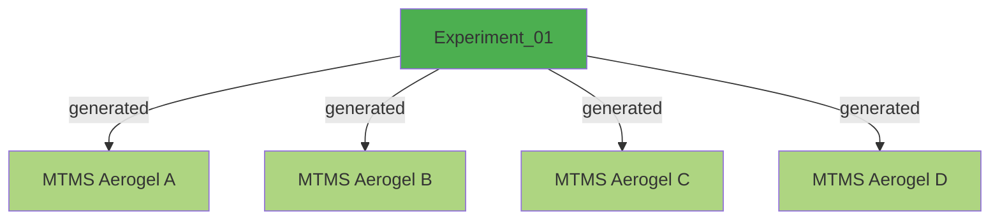

---

## MQ18: What is the transformation chain from alcogel to aerogel?

**Natural Language Question**: Which drying processes transform alcogels into aerogels?

**SPARQL Query**:
```sparql
PREFIX rdf: <http://www.w3.org/1999/02/22-rdf-syntax-ns#>
PREFIX rdfs: <http://www.w3.org/2000/01/rdf-schema#>
PREFIX pmat: <https://w3id.org/polymat/>
PREFIX gmat: <https://w3id.org/gelmat/>

SELECT ?drying ?dryingLabel ?alcogel ?alcogelLabel ?aerogel ?aerogelLabel
WHERE {
  ?drying rdf:type pmat:Drying ;
          rdfs:label ?dryingLabel ;
          gmat:usesSubstance ?alcogel ;
          gmat:producesAerogel ?aerogel .
  ?alcogel rdfs:label ?alcogelLabel .
  ?aerogel rdfs:label ?aerogelLabel .
}
ORDER BY ?dryingLabel
```

**Expected Results**: Each sample's drying process with corresponding alcogel input and aerogel output

**Mermaid Diagram**:
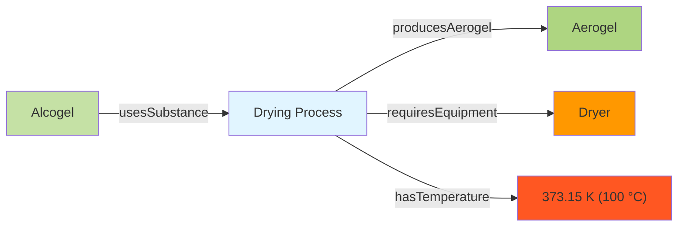

---

## MQ19: What gelation time equations are available in the database?

**Natural Language Question**: What gelation time approximation equations are documented in the data?

**SPARQL Query**:
```sparql
PREFIX rdf: <http://www.w3.org/1999/02/22-rdf-syntax-ns#>
PREFIX rdfs: <http://www.w3.org/2000/01/rdf-schema#>
PREFIX gmat: <https://w3id.org/gelmat/>

SELECT ?gelation ?gelationLabel ?comment
WHERE {
  ?gelation rdf:type gmat:Gelation ;
            rdfs:label ?gelationLabel ;
            rdfs:comment ?comment .
  FILTER(CONTAINS(?comment, "Gelation time"))
}
ORDER BY ?gelationLabel
```

**Expected Results**: Gelation time equations for samples E, F, G, H (e.g., tg = 17211e^-0.041Tg for Sample E)

**Mermaid Diagram**:
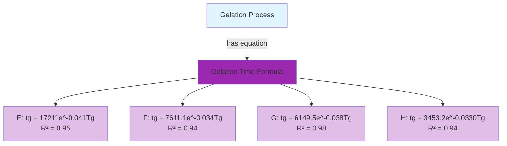

---

## MQ20: Compare all samples by their H₂O/MTMS molar ratio and activation energy

**Natural Language Question**: What is the relationship between H₂O/MTMS molar ratio and activation energy across samples?

**SPARQL Query**:
```sparql
PREFIX rdf: <http://www.w3.org/1999/02/22-rdf-syntax-ns#>
PREFIX rdfs: <http://www.w3.org/2000/01/rdf-schema#>
PREFIX gmat: <https://w3id.org/gelmat/>
PREFIX obo: <http://purl.obolibrary.org/obo/>
PREFIX om: <http://www.ontology-of-units-of-measure.org/resource/om-2/>

SELECT ?sample ?molarRatioValue ?activationEnergyValue
WHERE {
  # Get molar ratio: a quality inhering in the sol (the reacting mixture)
  ?molarRatio rdf:type gmat:MolarRatio ;
              obo:RO_0000052 ?sol ;
              om:hasValue ?mrValue .
  ?mrValue gmat:hasRatioString ?molarRatioValue .

  # The sol formation step that produced this sol
  ?solFormation gmat:generatesIntermediate ?sol .

  # Get synthesis containing this sol formation
  ?synthesis obo:BFO_0000051 ?solFormation ;
             obo:BFO_0000051 ?gelation ;
             rdfs:label ?sample .
  ?gelation rdf:type gmat:Gelation .
  
  # Get activation energy for gelation
  ?actEnergy obo:RO_0000052 ?gelation ;
             om:hasValue ?aeValue .
  ?aeValue om:hasNumericalValue ?activationEnergyValue ;
           om:hasUnit om:joulePerMole .   # SI: values in J/mol
}
ORDER BY ?molarRatioValue
```

**Expected Results**: Correlation between r values (8.09-12.94) and Ea (28890-35450 J/mol) for kinetic study samples

**Mermaid Diagram**:
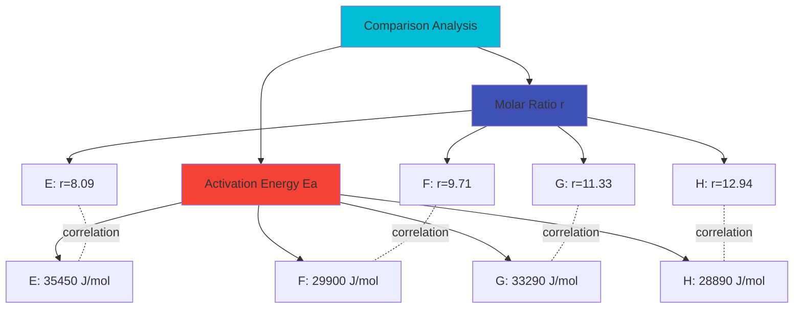

---

## Summary of Queries

| Query ID | Topic | Key Data Explored |
|----------|-------|-------------------|
| MQ1 | Synthesis Count | Total number of aerogel syntheses |
| MQ2 | Aerogels & Precursors | All aerogel samples with MTMS precursor |
| MQ3 | Process Steps | Complete synthesis workflow |
| MQ4 | Aging Duration | 48-hour aging time |
| MQ5 | Aging Temperature | 323.15 K (50 °C) aging temperature |
| MQ6 | Drying Temperature | 373.15 K (100 °C) drying temperature |
| MQ7 | MTMS/MeOH Ratios | Volume ratios 1:10 to 1:25 |
| MQ8 | H₂O/MTMS Ratios | Molar ratios (r values) |
| MQ9 | Equipment | Syringe pump usage |
| MQ10 | Substances | Chemical reagents |
| MQ11 | Intermediates | Sol, Wet Gel, Hydrogel, Alcogel |
| MQ12 | Flow Rate | 1.667e-8 m³/s (60 mL/h) pump setting |
| MQ13 | Overall Ratios | Complete reagent ratios |
| MQ14 | Activation Energy | Kinetic study data |
| MQ15 | Arrhenius Constants | Pre-exponential factors |
| MQ16 | Experiment Structure | Experiment-synthesis relationships |
| MQ17 | Generated Products | Experiment outputs |
| MQ18 | Drying Transformation | Alcogel to aerogel conversion |
| MQ19 | Gelation Equations | Time-temperature correlations |
| MQ20 | Ratio-Energy Comparison | Cross-parameter analysis |

The questions cover the chemical inputs and their ratios, the sequence of synthesis steps, the intermediate products from sol to aerogel, the process parameters and equipment settings, and the gelation kinetics of samples E to H. All queries run as shown against `gelmat.ttl` and `aerogel_data.ttl`.
